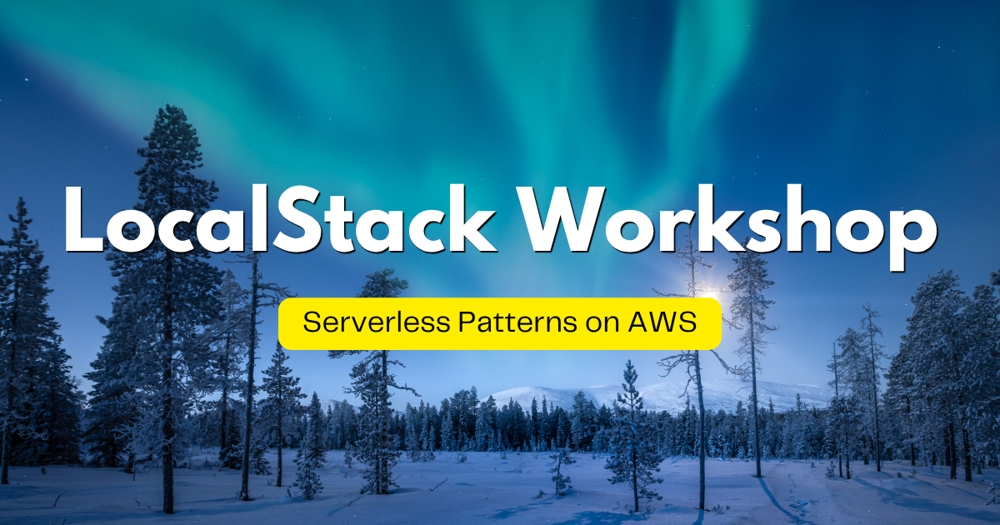

# LocalStack Workshop | Serverless Patterns on AWS

## Languages

- English (this page)
- [日本語 — Zenn Book「LocalStack 実践入門 | AWS サーバレスパターン開発ワークショップ」](https://zenn.dev/kakakakakku/books/aws-serverless-pattern-workshop-using-localstack)

## About

LocalStack is an AWS emulator that runs on your local machine or in CI environments. This is a hands-on workshop where you experience AWS serverless patterns using LocalStack.

The workshop uses GitHub Codespaces, so there is no need to set up an environment on your laptop — you can try it right away in your browser.

This workshop covers the following AWS services (in no particular order):

- AWS CloudFormation
- AWS SAM
- Amazon S3
- AWS Lambda
- Amazon CloudWatch
- Amazon CloudWatch Logs
- Amazon SNS
- Amazon API Gateway
- AWS Step Functions
- Amazon DynamoDB
- Amazon DynamoDB Streams
- Amazon Transcribe

## Table of Contents

1. [Learn from Serverless Patterns](docs/01-serverless-pattern.md)
2. [Set Up Your Workshop Environment](docs/02-setup.md)
3. [Process Images](docs/03-image-processing.md)
4. [Monitor Errors](docs/04-monitoring.md)
5. [Upload Files with a Presigned URL](docs/05-file-upload.md)
6. [Build a Workflow](docs/06-workflow.md)
7. [Trigger on Data Changes](docs/07-cdc.md)
8. [Transcribe Speech to Text](docs/08-speech-to-text.md)

## LocalStack Workshop Series

Check out the other workshops in the series!

|  |  |  |
|:---:|:---:|:---:|
| [Application Development on AWS](https://github.com/kakakakakku/aws-application-workshop-using-localstack) | [Terraform on AWS](https://github.com/kakakakakku/aws-terraform-workshop-using-localstack) | [Pulumi on AWS](https://github.com/kakakakakku/aws-pulumi-workshop-using-localstack) |

## Sponsors

If you find this workshop useful, consider supporting my work — it keeps the workshops maintained and motivates new ones 😃

- [GitHub Sponsors](https://github.com/sponsors/kakakakakku)
- [Buy Me a Coffee](https://buymeacoffee.com/kakakakakku)
