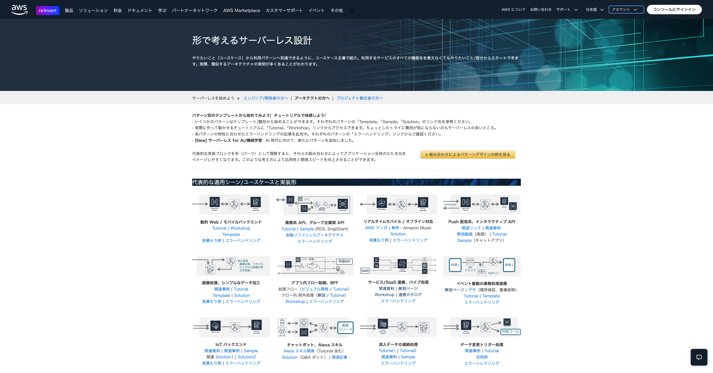
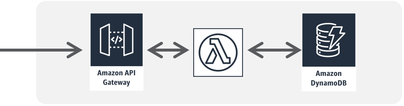
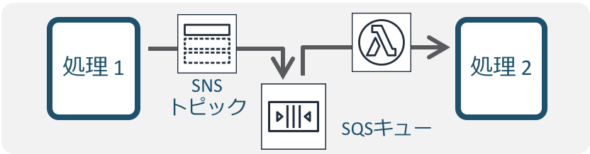

# Chapter 1: Learn from Serverless Patterns

## Introduction

LocalStack is an AWS emulator that runs on your local machine or in CI environments. It supports 120+ AWS services[^1], and even the free **LocalStack v4.14.0** covers the most commonly used ones.

It also works well as an environment for learning AWS, so it is a great fit for beginners who **want to learn AWS but worry about accidental charges**!

See the [LocalStack website](https://www.localstack.cloud/) for details.

This workshop is a sequel to another workshop, [LocalStack Workshop | Application Development on AWS](https://github.com/kakakakakku/aws-application-workshop-using-localstack), where you get started with LocalStack and experience local development and automated testing. I recommend going through them in order.

## What Are Serverless Patterns?

This workshop takes things one step further: the goal is to learn practical architectures with LocalStack.

You might wonder, "**What do you mean by practical architectures?**" This time, we use the AWS documentation [Serverless Patterns](https://aws.amazon.com/jp/serverless/patterns/serverless-pattern/) as a reference and deepen our understanding by deploying several of the architectures introduced there as serverless patterns.

A serverless pattern is something like a reference architecture for deploying serverless applications by combining AWS serverless services. Let's go ahead and look at the serverless patterns in the documentation! Even if you did not recognize them as serverless patterns, you may find yourself thinking, "**I have built something similar before!**"

I would be happy if, after reading this workshop, you come away feeling:

- I understand serverless patterns now!
- Wow, LocalStack can do this much!

## You've Been Using Serverless Patterns All Along

In fact, the workshop [LocalStack Workshop | Application Development on AWS](https://github.com/kakakakakku/aws-application-workshop-using-localstack) already used serverless patterns, even though it never called them out directly. For example, here is the architecture diagram we deployed in [Chapter 7](https://github.com/kakakakakku/aws-application-workshop-using-localstack/blob/main/docs/07-api.md) of that workshop.

The part where an API is implemented with Amazon API Gateway and AWS Lambda is similar to the serverless pattern "**Dynamic web/mobile backend**."

*Dynamic web/mobile backend*
*Quoted from [Serverless Patterns (AWS Japan, in Japanese)](https://aws.amazon.com/jp/serverless/patterns/serverless-pattern/)*

And the part where a message is put on an Amazon SQS queue and processed by AWS Lambda is similar to the serverless pattern "**Event-driven business process integration**."

*Event-driven business process integration*
*Quoted from [Serverless Patterns (AWS Japan, in Japanese)](https://aws.amazon.com/jp/serverless/patterns/serverless-pattern/)*

As you can see, the architectures you build every day may actually already be captured as patterns!

That's it for Chapter 1! ✋

**Next: [Chapter 2: Set Up Your Workshop Environment](02-setup.md)**

[^1]: Quoted from the "support for 120+ AWS services" statement on the LocalStack website.
