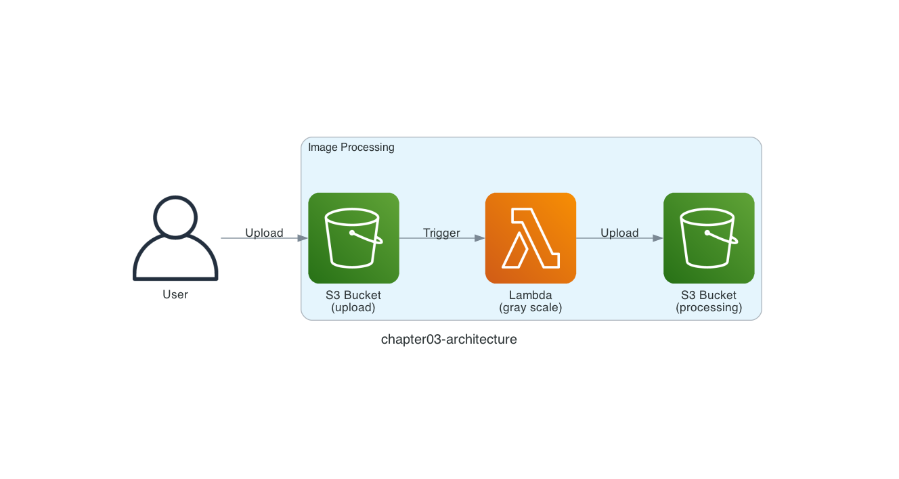

# Chapter 3: Process Images

## Serverless Pattern

In Chapter 3, let's start with the serverless pattern "**Image processing and simple data transformation**."

For example, you upload an image file to Amazon S3 and an AWS Lambda function performs simple image processing, or you upload a CSV file to Amazon S3 and an AWS Lambda function performs a simple calculation.

The key point is that, unlike a traditional batch job that periodically checks whether a file has been uploaded, the processing is triggered by the upload itself.


*Image processing and simple data transformation*
*Quoted from [Serverless Patterns (AWS Japan, in Japanese)](https://aws.amazon.com/jp/serverless/patterns/serverless-pattern/)*

## Architecture

The architecture looks like the diagram below.

When you upload an image file to Amazon S3, an AWS Lambda function converts it to grayscale and uploads the result to a different Amazon S3 bucket.



> [!NOTE]
> The AWS Lambda function uses the Python [Pillow](https://github.com/python-pillow/Pillow) library for image processing.

## Deploy the Serverless Application

Deploy the serverless application with the `samlocal` command.

```sh
$ cd ${CODESPACE_VSCODE_FOLDER}/chapter03
$ samlocal build
$ samlocal deploy

Successfully created/updated stack - chapter03-stack in us-east-1
```

If you see `Successfully created/updated stack - chapter03-stack`, it worked!

## Run the Serverless Application

As the target of the image processing, we use the AWS Lambda icon `Arch_AWS-Lambda_64.png`.


*Quoted from [AWS Architecture Icons](https://aws.amazon.com/architecture/icons/)*

Let's go ahead and upload the image file to the Amazon S3 bucket with the `awslocal` command.

```sh
$ awslocal s3api put-object \
  --bucket chapter03-upload-bucket \
  --key Arch_AWS-Lambda_64.png \
  --body ./images/Arch_AWS-Lambda_64.png
```

## Verify the Resources

Let's use the LocalStack AWS CLI (`awslocal`) to check the chapter03-processing-bucket bucket! The `gray-scale-Arch_AWS-Lambda_64.png` object should be saved to the Amazon S3 bucket.

```sh
$ awslocal s3 ls chapter03-processing-bucket
2026-07-27 00:00:00       1029 gray-scale-Arch_AWS-Lambda_64.png
```

When you download and open it, you can see that the image has been converted to grayscale.

```sh
$ awslocal s3 cp s3://chapter03-processing-bucket/gray-scale-Arch_AWS-Lambda_64.png .
```


That's how you experience the serverless pattern of processing an image, triggered by the image file upload.

That's it for Chapter 3! ✋

## Code Walkthrough

Here is a quick walkthrough of the key points in the code. Feel free to skip this section.

### `src/app.py`

First, when you configure an Amazon S3 event notification for AWS Lambda, the event message arrives in a fixed format. The format is documented in the [AWS Lambda documentation on using AWS Lambda with Amazon S3](https://docs.aws.amazon.com/lambda/latest/dg/with-s3.html).

Each message is contained under the `Records` key, so we retrieve them with `event['Records']`.

```python
def lambda_handler(event, context):
    for record in event['Records']:
        upload_key = record['s3']['object']['key']
        upload_file = f'/tmp/{os.path.basename(upload_key)}'

        s3.download_file(
            Bucket=record['s3']['bucket']['name'],
            Key=upload_key,
            Filename=upload_file,
        )
```

Note that what the AWS Lambda function receives as an event is not the object uploaded to Amazon S3 itself, but information about the uploaded object.

Here we implement `record['s3']['object']['key']` to get the key of the uploaded object, and then use the Amazon S3 [`download_file()`](https://boto3.amazonaws.com/v1/documentation/api/latest/reference/services/s3/client/download_file.html) function to download it into the `/tmp` directory.

AWS Lambda functions can use the `/tmp` directory as [ephemeral storage](https://docs.aws.amazon.com/lambda/latest/dg/configuration-ephemeral-storage.html).

### `template.yaml`

The trigger configuration "**call the AWS Lambda function when an object is uploaded to Amazon S3**" is declared in the AWS SAM template. Here we specify `s3:ObjectCreated:*`, but there are other values you can use. For example, `s3:ObjectRemoved:*` calls the AWS Lambda function when an object is deleted from Amazon S3.

```yaml
Function:
  Type: AWS::Serverless::Function
  Properties:
    FunctionName: chapter03-function
    CodeUri: ./src
    Handler: app.lambda_handler
    Runtime: python3.13
    Architectures:
      - x86_64
    Events:
      Upload:
        Type: S3
        Properties:
          Bucket: !Ref UploadBucket
          Events: s3:ObjectCreated:*
```

See the [AWS SAM S3 event source documentation](https://docs.aws.amazon.com/serverless-application-model/latest/developerguide/sam-property-function-s3.html) for details.

That's it for the code walkthrough.

**Next: [Chapter 4: Monitor Errors](04-monitoring.md)**
