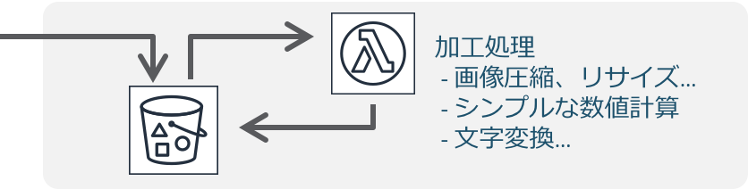
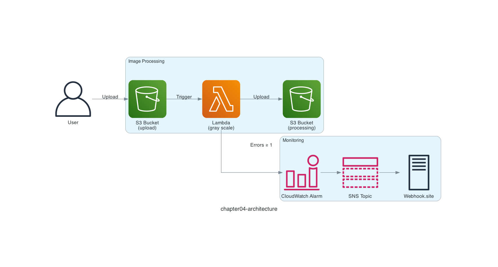

# Chapter 4: Monitor Errors

## Serverless Pattern

In Chapter 4, we extend the serverless pattern "**Image processing and simple data transformation**" that you experienced in Chapter 3.

In fact, the Chapter 3 implementation had an intentional bug: if you upload a non-image file, the AWS Lambda function fails. Ideally you would add validation at upload time, but this time let's introduce a monitoring mechanism that sends a notification when the AWS Lambda function fails!


*Image processing and simple data transformation*
*Quoted from [Serverless Patterns (AWS Japan, in Japanese)](https://aws.amazon.com/jp/serverless/patterns/serverless-pattern/)*

## Architecture

The architecture looks like the diagram below.

The file upload part is the same as Chapter 3, but this time we monitor the `Errors` metric of the AWS Lambda function that converts images to grayscale. If even a single error occurs, we send a notification through an Amazon CloudWatch alarm and an Amazon SNS topic.



A common combination is to send an email through an Amazon SNS topic, but setting up email delivery with LocalStack takes some extra effort, so this time we receive a webhook instead of an email. [Webhook.site](https://webhook.site) is a handy service that provides a temporary webhook endpoint.

Open Webhook.site and copy the webhook endpoint shown under **Your unique URL**, which looks like `https://webhook.site/xxxxxxxx-xxxx-xxxx-xxxx-xxxxxxxxxxxx`.

## Deploy the Serverless Application

Deploy the serverless application with the `samlocal` command.

This time, pass the Webhook.site webhook endpoint you copied as a parameter when running the command.

```sh
$ cd ${CODESPACE_VSCODE_FOLDER}/chapter04
$ samlocal build
$ samlocal deploy --parameter-overrides WEBHOOK='https://webhook.site/xxxxxxxx-xxxx-xxxx-xxxx-xxxxxxxxxxxx'

Successfully created/updated stack - chapter04-stack in us-east-1
```

If you see `Successfully created/updated stack - chapter04-stack`, it worked!

## Confirm the Amazon SNS Subscription

When you open Webhook.site, you should see a webhook titled **SubscriptionConfirmation**. To confirm the Amazon SNS subscription, copy the **SubscribeURL** found inside **Raw Content** and run the following command. If the XML shows `ConfirmSubscriptionResponse`, it worked!

> [!NOTE]
> You need to wrap the **SubscribeURL** in single quotes when running it. The XML below is shown as a sample of the command output.

```sh
$ curl '<SubscribeURL>'
<?xml version='1.0' encoding='utf-8'?>
<ConfirmSubscriptionResponse xmlns="http://sns.amazonaws.com/doc/2010-03-31/"><ConfirmSubscriptionResult><SubscriptionArn>arn:aws:sns:us-east-1:000000000000:topic-8cc3351e:948cc8e6-b699-4342-94df-eba4a354b8fb</SubscriptionArn></ConfirmSubscriptionResult><ResponseMetadata><RequestId>56a04250-31b3-41ad-aff4-5197a78a1f40</RequestId></ResponseMetadata></ConfirmSubscriptionResponse>
```

## Run the Serverless Application

Let's go ahead and upload a non-image file, `template.yaml`, to the Amazon S3 bucket with the `awslocal` command.

```sh
$ awslocal s3api put-object \
  --bucket chapter04-upload-bucket \
  --key template.yaml \
  --body ./template.yaml
```

## Check the Notification

Open Webhook.site again, and you should see one more webhook. If the **Subject** inside **Raw Content** reads `"ALARM: \"chapter04-alarm\" in us-east-1"`, it worked! Because you uploaded a non-image file to Amazon S3 and the AWS Lambda function failed, a notification was sent to the webhook endpoint.

> [!NOTE]
> You might receive multiple notifications, but that is fine.

That's it for Chapter 4! ✋

## Code Walkthrough

Here is a quick walkthrough of the key points in the code. Feel free to skip this section.

### `src/app.py`

The same as Chapter 3.

### `template.yaml`

The difference from Chapter 3 is that the AWS SAM template implements the monitoring mechanism.

This time, when the value of the AWS Lambda function's `Errors` metric exceeds 1, an alert is sent through Amazon SNS.

```yaml
Alarm:
  Type: AWS::CloudWatch::Alarm
  Properties:
    AlarmName: chapter04-alarm
    MetricName: Errors
    Namespace: AWS/Lambda
    ComparisonOperator: GreaterThanOrEqualToThreshold
    EvaluationPeriods: 1
    Period: 10
    Statistic: Sum
    Threshold: 1
    AlarmActions:
      - !Ref Topic
    Dimensions:
      - Name: FunctionName
        Value: !Ref Function
Topic:
  Type: AWS::SNS::Topic
  Properties:
    DisplayName: chapter04-topic
    Subscription:
      - Protocol: https
        Endpoint: !Ref WEBHOOK
```

The most common subscription for an Amazon SNS topic is Email. You can implement it in the AWS SAM template as follows. However, because setting up email delivery with LocalStack takes some extra effort, we chose to use Webhook.site this time.

```yaml
Topic:
  Type: AWS::SNS::Topic
  Properties:
    DisplayName: chapter04-topic
    Subscription:
      - Protocol: email
        Endpoint: kakakakakku@example.com
```

That's it for the code walkthrough.

**Next: [Chapter 5: Upload Files with a Presigned URL](05-file-upload.md)**
