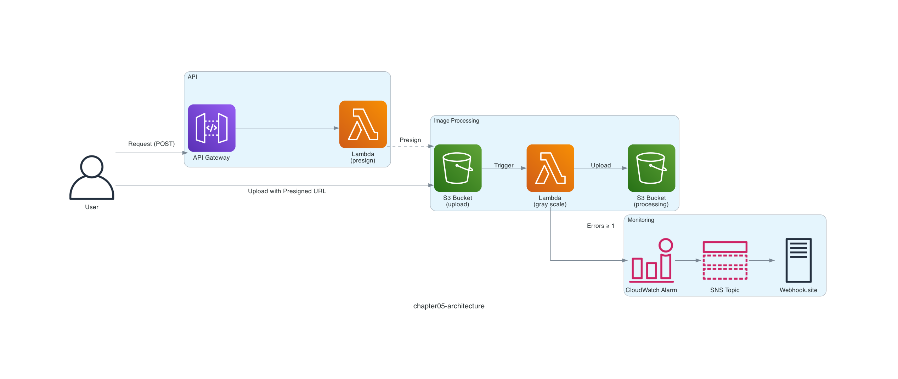

# Chapter 5: Upload Files with a Presigned URL

## Serverless Pattern

In Chapter 5, we further extend the serverless pattern "**Image processing and simple data transformation**" that you experienced in Chapters 3 and 4. The architecture is expanding one step at a time!

In Chapters 3 and 4, we uploaded files to the Amazon S3 bucket with the `awslocal` command. Next, anticipating a future integration with a frontend, let's introduce a mechanism to upload files through an API!


*Image processing and simple data transformation*
*Quoted from [Serverless Patterns (AWS Japan, in Japanese)](https://aws.amazon.com/jp/serverless/patterns/serverless-pattern/)*

## Architecture

The architecture looks like the diagram below.

This time we use an Amazon S3 **presigned URL** to upload files. A presigned URL is like a feature that issues a temporary URL for uploading a file directly to Amazon S3. To issue this presigned URL, we deploy an API using Amazon API Gateway and an AWS Lambda function.



## Deploy the Serverless Application

Deploy the serverless application with the `samlocal` command.

The Webhook.site webhook endpoint you pass as a parameter can be the same value as in Chapter 4.

```sh
$ cd ${CODESPACE_VSCODE_FOLDER}/chapter05
$ samlocal build
$ samlocal deploy --parameter-overrides WEBHOOK='https://webhook.site/xxxxxxxx-xxxx-xxxx-xxxx-xxxxxxxxxxxx'

Successfully created/updated stack - chapter05-stack in us-east-1
```

If you see `Successfully created/updated stack - chapter05-stack`, it worked!

You should also see output like the following near the end of the deploy result. Copy the value of `ApiId` (`xxxxxxxxxx` in the example below).

```
Key                 ApiId
Description         -
Value               xxxxxxxxxx
```

## Confirm the Amazon SNS Subscription

Just like in Chapter 4, when you open Webhook.site you should see a webhook titled **SubscriptionConfirmation**. To confirm the Amazon SNS subscription, copy the **SubscribeURL** found inside **Raw Content** and run the following command. If the XML shows `ConfirmSubscriptionResponse`, it worked!

> [!NOTE]
> You need to wrap the **SubscribeURL** in single quotes when running it. The XML below is shown as a sample of the command output.

```sh
$ curl '<SubscribeURL>'
<?xml version='1.0' encoding='utf-8'?>
<ConfirmSubscriptionResponse xmlns="http://sns.amazonaws.com/doc/2010-03-31/"><ConfirmSubscriptionResult><SubscriptionArn>arn:aws:sns:us-east-1:000000000000:topic-8cc3351e:948cc8e6-b699-4342-94df-eba4a354b8fb</SubscriptionArn></ConfirmSubscriptionResult><ResponseMetadata><RequestId>56a04250-31b3-41ad-aff4-5197a78a1f40</RequestId></ResponseMetadata></ConfirmSubscriptionResponse>
```

## Run the Serverless Application

The Amazon API Gateway you deployed returns a presigned URL when you send a POST request to the `/presign` API. The API expects the name of the file to upload in the POST request body, in the form `{ "filename": "xxx" }`.

This time we use the Amazon API Gateway icon `Arch_Amazon-API-Gateway_64.png`.


*Quoted from [AWS Architecture Icons](https://aws.amazon.com/architecture/icons/)*

Replace `xxxxxxxxxx` in the URL below with the value of `ApiId` from the deploy result, and call Amazon API Gateway.

```sh
$ curl -s -X POST http://xxxxxxxxxx.execute-api.localhost.localstack.cloud:4566/Prod/presign \
  -H 'Content-Type: application/json' \
  -d '{ "filename": "Arch_Amazon-API-Gateway_64.png" }' | tee presign.json
```

When you run the API, it should return a URL with many query parameters. This is the presigned URL. It is valid only for the specified duration (300 seconds this time), and you can upload a file directly to Amazon S3 with it. That means, for example, when you implement a file upload feature, the frontend does not need permissions to operate Amazon S3. More precisely, the presigned URL itself carries the permissions to operate Amazon S3.

Now let's upload the Amazon API Gateway icon to the presigned URL that was returned.

```sh
$ URL=$(jq -r '.url' presign.json)
$ curl -X PUT --upload-file ./images/Arch_Amazon-API-Gateway_64.png ${URL}
```

## Verify the Resources

Let's use the LocalStack AWS CLI (`awslocal`) to check the chapter05-processing-bucket bucket! The `gray-scale-Arch_Amazon-API-Gateway_64.png` object should be saved to the Amazon S3 bucket.

```sh
$ awslocal s3 ls chapter05-processing-bucket
2026-07-27 00:00:00        570 gray-scale-Arch_Amazon-API-Gateway_64.png
```

When you download and open it, you can see that the image has been converted to grayscale.

```sh
$ awslocal s3 cp s3://chapter05-processing-bucket/gray-scale-Arch_Amazon-API-Gateway_64.png .
```


As you can see, a presigned URL lets you upload objects without making Amazon S3 public.

That's it for Chapter 5! ✋

## Code Walkthrough

Here is a quick walkthrough of the key points in the code. Feel free to skip this section.

### `src/processing.py`

The same as `src/app.py` in Chapters 3 and 4. We renamed the file for clarity.

### `src/presign.py`

We use the Amazon S3 [`generate_presigned_url()`](https://boto3.amazonaws.com/v1/documentation/api/1.35.9/reference/services/s3/client/generate_presigned_url.html) function to generate the presigned URL.

```python
url = s3.generate_presigned_url(
    ClientMethod='put_object',
    Params={
        'Bucket': 'chapter05-upload-bucket',
        'Key': filename,
    },
    ExpiresIn=300,
)
```

There are two main points: `ClientMethod` and `ExpiresIn`. `ClientMethod` specifies the action to run through the presigned URL. Since we use it to upload an object here, we set it to `put_object`. This `put_object` refers to the Boto3 [`put_object`](https://boto3.amazonaws.com/v1/documentation/api/1.35.9/reference/services/s3/client/put_object.html) function, so `Params` are the arguments of the `put_object` function. And `ExpiresIn` specifies the presigned URL's expiration in seconds. Here we set it to 300 seconds (5 minutes).

We used a presigned URL for uploading an object this time, but if you specify `ClientMethod='get_object'`, for example, you can also use a presigned URL for downloading an object. This is often used to share an object temporarily and with limited access. For example, you can generate a presigned URL for downloading an object with a command like this:

```sh
$ awslocal s3 presign s3://chapter05-upload-bucket/Arch_Amazon-API-Gateway_64.png --expires-in 300
```

That's it for the code walkthrough.

**Next: [Chapter 6: Build a Workflow](06-workflow.md)**
