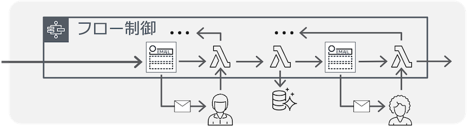
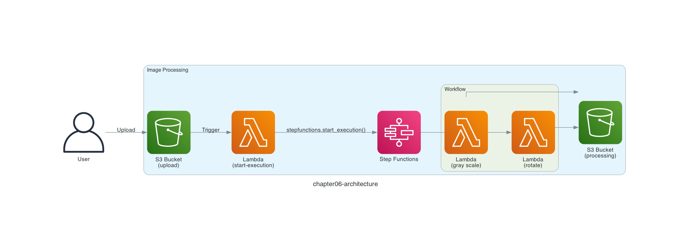
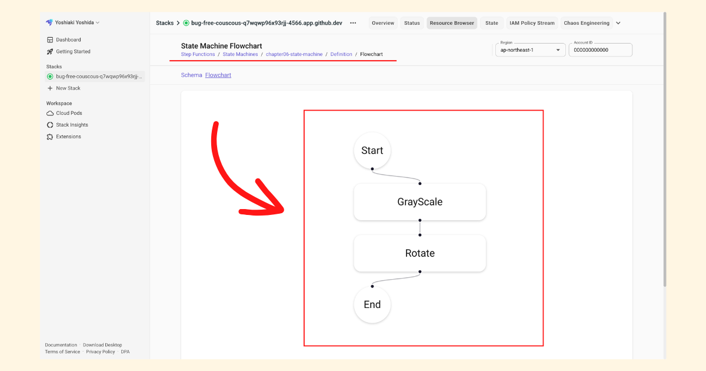
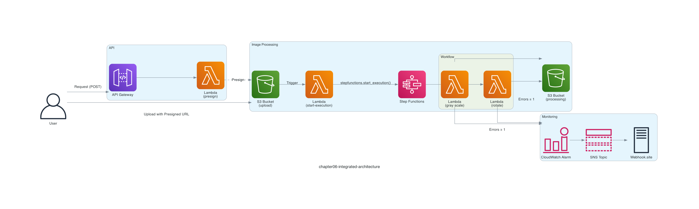

# Chapter 6: Build a Workflow

## Serverless Pattern

In Chapter 6, let's experience yet another serverless pattern, "**Business/approval workflow**."

In Chapters 3, 4, and 5, we had a single, simple image-processing logic. But there are situations where you want to run a check on the image file before processing it, add another image-processing step, and combine multiple pieces of logic into a single workflow.


*Business/approval workflow*
*Quoted from [Serverless Patterns (AWS Japan, in Japanese)](https://aws.amazon.com/jp/serverless/patterns/serverless-pattern/)*

## Architecture

The architecture looks like the diagram below.

We use AWS Step Functions to combine the image-processing AWS Lambda functions into a workflow. This time, in addition to the same grayscale conversion as Chapter 3, we add image processing that rotates the image 180 degrees.



> [!NOTE]
> When invoking AWS Step Functions, you can also use Amazon EventBridge instead of an AWS Lambda function. See [Trigger a Step Functions state machine using Amazon S3 and EventBridge](https://docs.aws.amazon.com/step-functions/latest/dg/tutorial-cloudwatch-events-s3.html) for details.

## Deploy the Serverless Application

Deploy the serverless application with the `samlocal` command.

```sh
$ cd ${CODESPACE_VSCODE_FOLDER}/chapter06
$ samlocal build
$ samlocal deploy

Successfully created/updated stack - chapter06-stack in us-east-1
```

If you see `Successfully created/updated stack - chapter06-stack`, it worked!

Let's use the LocalStack AWS CLI (`awslocal`) to check the chapter06-state-machine workflow! The `definition` in the result defines a workflow that runs GrayScale and Rotate in order.

```sh
$ awslocal stepfunctions describe-state-machine \
    --state-machine-arn arn:aws:states:us-east-1:000000000000:stateMachine:chapter06-state-machine
{
    "stateMachineArn": "arn:aws:states:us-east-1:000000000000:stateMachine:chapter06-state-machine",
    "name": "chapter06-state-machine",
    "status": "ACTIVE",
    "definition": "{\n  \"QueryLanguage\": \"JSONata\",\n  \"StartAt\": \"GrayScale\",\n  \"States\": {\n    \"GrayScale\": {\n      \"Type\": \"Task\",\n      \"Resource\": \"arn:aws:lambda:us-east-1:000000000000:function:chapter06-gray-scale-function\",\n      \"Assign\": {\n        \"inputPayload\": \"\"\n      },\n      \"Next\": \"Rotate\"\n    },\n    \"Rotate\": {\n      \"Type\": \"Task\",\n      \"Resource\": \"arn:aws:lambda:us-east-1:000000000000:function:chapter06-rotate-function\",\n      \"Arguments\" : {\n        \"Records\" : \"\"\n      },\n      \"End\": true\n    }\n  }\n}\n",
    "roleArn": "arn:aws:iam::000000000000:role/chapter06-stack-StateMachineRole-2335411f",
    "type": "STANDARD",
    "creationDate": "2026-07-27T00:00:00.000000+00:00",
    "loggingConfiguration": {
        "level": "OFF",
        "includeExecutionData": false
    }
}
```

Since the `definition` is hard to read as is, here is the workflow diagram displayed in the LocalStack Resource Browser for reference.



## Run the Serverless Application

As the target of the image processing, we use the AWS Lambda icon `Arch_AWS-Lambda_64.png`.


*Quoted from [AWS Architecture Icons](https://aws.amazon.com/architecture/icons/)*

Let's go ahead and upload the image file to the Amazon S3 bucket with the `awslocal` command.

```sh
$ awslocal s3api put-object \
  --bucket chapter06-upload-bucket \
  --key Arch_AWS-Lambda_64.png \
  --body ./images/Arch_AWS-Lambda_64.png
```

## Verify the Resources

Let's use the LocalStack AWS CLI (`awslocal`) to check the chapter06-processing-bucket bucket! The `gray-scale-Arch_AWS-Lambda_64.png` object and the `rotated-Arch_AWS-Lambda_64.png` object should be saved to the Amazon S3 bucket.

```sh
$ awslocal s3 ls chapter06-processing-bucket
2026-07-27 00:00:00       1029 gray-scale-Arch_AWS-Lambda_64.png
2026-07-27 00:00:00       2262 rotated-Arch_AWS-Lambda_64.png
```

When you download and open them, you can see that the images have been processed as follows.

```sh
$ awslocal s3 cp s3://chapter06-processing-bucket/gray-scale-Arch_AWS-Lambda_64.png .
$ awslocal s3 cp s3://chapter06-processing-bucket/rotated-Arch_AWS-Lambda_64.png .
```


*gray-scale-Arch_AWS-Lambda_64.png*


*rotated-Arch_AWS-Lambda_64.png*

## Architecture (Chapter 5 + Chapter 6)

This time we focused on experiencing the serverless pattern "**Business/approval workflow**" with AWS Step Functions, but of course you can also combine Chapter 5 and Chapter 6. This makes for a very practical architecture!



That's it for Chapter 6! ✋

## Code Walkthrough

Here is a quick walkthrough of the key points in the code. Feel free to skip this section.

### `src/start-execution.py`

Until now, the AWS Lambda function that received the event notification from Amazon S3 performed the image processing directly. This time, we use the AWS Step Functions [`stepfunctions.start_execution()`](https://boto3.amazonaws.com/v1/documentation/api/1.35.9/reference/services/stepfunctions/client/start_execution.html) function to run the workflow, passing it the event information.

```python
def lambda_handler(event, context):
    stepfunctions.start_execution(
        stateMachineArn=os.environ['STATE_MACHINE_ARN'],
        input=json.dumps(event),
    )
```

### `chapter06.asl.json`

The AWS Step Functions workflow is deployed with AWS SAM, but the workflow itself is defined in `chapter06.asl.json`. Focus on `StartAt`, `Next`, and `End` to picture the flow. The `GrayScale` image processing is the same as the one used in Chapters 3, 4, and 5, and this time we also add a `Rotate` image-processing step.

```json
{
  "QueryLanguage": "JSONata",
  "StartAt": "GrayScale",
  "States": {
    "GrayScale": {
      "Type": "Task",
      "Resource": "${GrayScaleFunctionArn}",
      "Assign": {
        "inputPayload": ""
      },
      "Next": "Rotate"
    },
    "Rotate": {
      "Type": "Task",
      "Resource": "${RotateFunctionArn}",
      "Arguments" : {
        "Records" : ""
      },
      "End": true
    }
  }
}
```

This is a simple workflow, but AWS Step Functions workflows can also define more complex state transitions such as [`Choice`](https://docs.aws.amazon.com/step-functions/latest/dg/workflow-states.html) (branching) and `Parallel` (parallel execution).

This workshop also uses the [JSONata](https://jsonata.org/) syntax and variables, a feature released on November 22, 2024. In this simple workflow it is hard to feel the benefit, but JSONata offers flexible data manipulation and makes it easy to pass task results around using variables, so it has many advantages and I expect it will be used more actively going forward. With that in mind, I chose to build this workflow with the new feature. See [Transforming data with JSONata](https://docs.aws.amazon.com/step-functions/latest/dg/transforming-data.html) for details.

> [!NOTE]
> The AWS Step Functions JSONata and variables feature is supported in LocalStack v4.0.1. See the [LocalStack blog post on AWS Step Functions](https://blog.localstack.cloud/aws-step-functions-made-easy/) for details.

That's it for the code walkthrough.

**Next: [Chapter 7: Trigger on Data Changes](07-cdc.md)**
