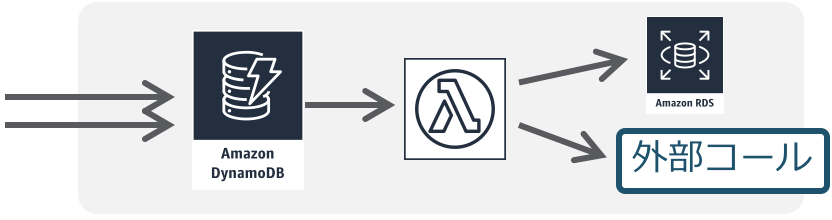
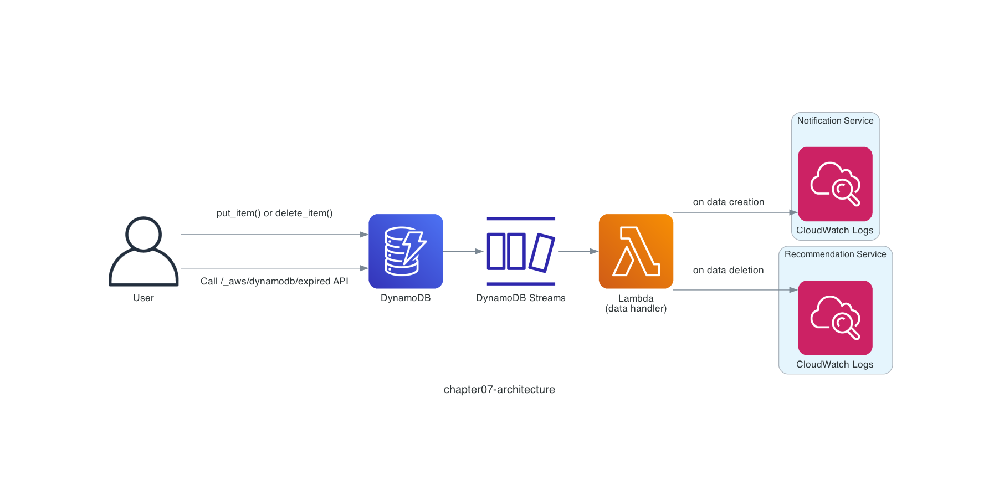

# Chapter 7: Trigger on Data Changes

## Serverless Pattern

In Chapter 7, let's experience yet another serverless pattern, "**Data change trigger processing**."


*Data change trigger processing*
*Quoted from [Serverless Patterns (AWS Japan, in Japanese)](https://aws.amazon.com/jp/serverless/patterns/serverless-pattern/)*

Data change trigger processing is sometimes called **CDC (Change Data Capture)**. It is an architecture that triggers other processing when data is added, changed, or deleted in a database, keeping the data change and the associated processing loosely coupled. For example, it might reflect the data into another database such as Amazon RDS or Amazon Aurora, or it might call another microservice.

## Architecture

The architecture looks like the diagram below.

This time, let's think about a coupon feature scenario. We manage coupon information in an Amazon DynamoDB table. When a coupon is registered, we call a "notification service" that notifies the user, and when a coupon is deleted, we call a "recommendation service" that analyzes the user's coupon usage. Amazon DynamoDB Streams lets you capture data changes in an Amazon DynamoDB table.

To keep the focus on experiencing the serverless pattern "**Data change trigger processing**," we substitute log output to Amazon CloudWatch Logs for the actual service calls.



## Deploy the Serverless Application

Deploy the serverless application with the `samlocal` command.

```sh
$ cd ${CODESPACE_VSCODE_FOLDER}/chapter07
$ samlocal build
$ samlocal deploy

Successfully created/updated stack - chapter07-stack in us-east-1
```

If you see `Successfully created/updated stack - chapter07-stack`, it worked!

## Run the Serverless Application

Let's go ahead and register coupon data in the Amazon DynamoDB table with the `awslocal` command.

First, register a **15% Discount Coupon**.

```sh
$ awslocal dynamodb put-item --table-name chapter07-table \
    --item '{ "id": { "S": "a2b9a09f-9041-4b40-a9a8-600cd3c5f754" }, "user_id": { "S": "user1" }, "title": { "S": "15% Discount Coupon" }, "expired_at": { "N": "1924873200" } }'
```

> [!NOTE]
> The coupon's expiration is set in `expired_at`. This time we use a future date, `1924873200 (2030/12/31 00:00:00)`.

Then use the LocalStack AWS CLI (`awslocal`) to check the logs in the `/aws/lambda/chapter07-function` log group!

```sh
$ awslocal logs tail /aws/lambda/chapter07-function
```

You should see a registration log (`~ has been added.`) like the following. We substitute log output here, but imagine that the notification service is being called 📩

```python
{
'message': 'A coupon `a2b9a09f-9041-4b40-a9a8-600cd3c5f754` has been added.',
'id': 'a2b9a09f-9041-4b40-a9a8-600cd3c5f754',
'title': '15% Discount Coupon',
'expired_at': '1924873200'
}
```

Next, register a **10% Discount Coupon**.

```sh
$ awslocal dynamodb put-item --table-name chapter07-table \
    --item '{ "id": { "S": "629a27ab-b6e9-426f-92ac-f4e9fb71ed5c" }, "user_id": { "S": "user1" }, "title": { "S": "10% Discount Coupon" }, "expired_at": { "N": "1924873200" } }'
```

Now let's try a scenario where a coupon is deleted. You already have the **15% Discount Coupon**, so you might decide to get rid of the **10% Discount Coupon**! Run the `awslocal` command.

```sh
$ awslocal dynamodb delete-item --table-name chapter07-table \
    --key ' { "id": { "S": "629a27ab-b6e9-426f-92ac-f4e9fb71ed5c" } }'
```

Let's check the `/aws/lambda/chapter07-function` log group again!

```sh
$ awslocal logs tail /aws/lambda/chapter07-function
```

This time you should see a deletion log (`~ has been removed.`) like the following. We substitute log output here, but imagine that the recommendation service is being called 🛳️

```python
{
'message': 'A coupon `629a27ab-b6e9-426f-92ac-f4e9fb71ed5c` has been removed.',
'id': '629a27ab-b6e9-426f-92ac-f4e9fb71ed5c',
'title': '10% Discount Coupon',
'expired_at': '1924873200'
}
```

Now let's try one more pattern: a coupon that is deleted automatically when it expires. This time we register a **20% Discount Coupon**, and the key is the value set in `expired_at`. `1732978800` is the UNIX timestamp for `2024/12/01 00:00:00`. So let's register a coupon that has already expired.

```sh
$ awslocal dynamodb put-item --table-name chapter07-table \
    --item '{ "id": { "S": "5db8bac9-ce46-405f-b916-c925cf054d2b" }, "user_id": { "S": "user1" }, "title": { "S": "20% Discount Coupon" }, "expired_at": { "N": "1732978800" } }'
```

Amazon DynamoDB has a feature called **TTL (Time to Live)**. When the UNIX timestamp of the attribute set as the TTL target passes, Amazon DynamoDB automatically deletes the data. See the [Amazon DynamoDB TTL documentation](https://docs.aws.amazon.com/amazondynamodb/latest/developerguide/TTL.html) for details.

> [!NOTE]
> As the documentation notes — "DynamoDB typically deletes expired items within a few days of their expiration time" — expired items are not deleted immediately.

LocalStack supports the Amazon DynamoDB TTL feature and offers two ways to run it.

1. Delete every hour
2. Call an API

The "delete every hour" approach is similar to the behavior of the Amazon DynamoDB TTL feature, deleting asynchronously after expiration. But since LocalStack is mainly used while developing locally, waiting an hour is inefficient. So this time we call the [dedicated API implemented in LocalStack](https://docs.localstack.cloud/user-guide/aws/dynamodb/).

When you run the following API, you can see that the item was deleted.

```sh
$ curl -X DELETE http://localhost:4566/_aws/dynamodb/expired
{"ExpiredItems": 1}
```

Let's check the `/aws/lambda/chapter07-function` log group again!

```sh
$ awslocal logs tail /aws/lambda/chapter07-function
```

You should again see a deletion log (`~ has been removed.`) like the following. In this way, deletions triggered automatically by the Amazon DynamoDB TTL feature can be captured as well.

```python
{
'message': 'A coupon `5db8bac9-ce46-405f-b916-c925cf054d2b` has been removed.',
'id': '5db8bac9-ce46-405f-b916-c925cf054d2b',
'title': '20% Discount Coupon',
'expired_at': '1732978800'
}
```

## About Deletion

As you experienced, there are two ways to delete data in Amazon DynamoDB: "**deleting explicitly**" and "**being deleted automatically by TTL**."

When, as in this coupon feature, the data has a fixed expiration and you want it to expire automatically, the Amazon DynamoDB TTL feature is convenient. Because TTL deletes the data automatically, you gain the architectural benefit of not having to manage a scheduled job that runs, for example, daily. Moreover, as the documentation states — "You aren't charged for the write capacity units (WCU) consumed by TTL deletions" — there is also a cost benefit.

## About the `userIdentity` Field

There are also cases where you want to handle things differently depending on whether the data was deleted explicitly or automatically by TTL. For example, an explicit deletion strongly suggests the user found the coupon unnecessary, whereas an automatic TTL deletion may simply mean the user did not have a chance to use the coupon. In such cases, you can determine this with the Amazon DynamoDB Streams `userIdentity` field. When an item is deleted automatically by TTL, the value `{'user_identity': {'principalId': 'dynamodb.amazonaws.com', 'type': 'Service'}}` is added. See the [Amazon DynamoDB Streams and Time to Live documentation](https://docs.aws.amazon.com/amazondynamodb/latest/developerguide/time-to-live-ttl-streams.html) for details.

However, at the moment the `userIdentity` field is not implemented in LocalStack, and in Python it returns `None`. I have [filed an issue with LocalStack](https://github.com/localstack/localstack/issues/11343).

> [!NOTE]
> The issue ended up being closed.

It is good to understand that LocalStack still has mechanisms that are not yet implemented.

That's it for Chapter 7! ✋

## Code Walkthrough

Here is a quick walkthrough of the key points in the code. Feel free to skip this section.

### `template.yaml`

We deploy the Amazon DynamoDB table with AWS SAM, and this time we specify `TimeToLiveSpecification` and `StreamSpecification`.

`TimeToLiveSpecification` enables the Amazon DynamoDB TTL feature, marking an item for deletion once the date set in `expired_at` has passed.

And `StreamSpecification` enables Amazon DynamoDB Streams. There are four possible values, and this time we specify `NEW_AND_OLD_IMAGES`, which can capture all of the data both before and after the change.

- KEYS_ONLY
- NEW_IMAGE
- OLD_IMAGE
- NEW_AND_OLD_IMAGES

```yaml
Table:
  Type: AWS::DynamoDB::Table
  Properties:
    TableName: chapter07-table
    AttributeDefinitions:
      - AttributeName: id
        AttributeType: S
    KeySchema:
      - AttributeName: id
        KeyType: HASH
    BillingMode: PAY_PER_REQUEST
    TimeToLiveSpecification:
      AttributeName: expired_at
      Enabled: true
    StreamSpecification:
      StreamViewType: NEW_AND_OLD_IMAGES
```

See the [Amazon DynamoDB Streams documentation](https://docs.aws.amazon.com/amazondynamodb/latest/developerguide/Streams.html) for details.

### `src/app.py`

When an AWS Lambda function is triggered from Amazon DynamoDB Streams, the event message also arrives in a fixed format. The format is documented in the [AWS Lambda documentation on using AWS Lambda with Amazon DynamoDB](https://docs.aws.amazon.com/lambda/latest/dg/with-ddb.html).

The captured data is contained in `NewImage` and `OldImage`, so when a coupon is registered we read the data from `NewImage`, and when a coupon is deleted we read it from `OldImage`.

```python
def lambda_handler(event, context):
    for record in event['Records']:
        if record['eventName'] == 'INSERT':
            id = record['dynamodb']['NewImage']['id']['S']
            notify(
                {
                    'message': f'A coupon `{id}` has been added.',
                    'id': id,
                    'title': record['dynamodb']['NewImage']['title']['S'],
                    'expired_at': record['dynamodb']['NewImage']['expired_at']['N'],
                }
            )
        if record['eventName'] == 'REMOVE':
            id = record['dynamodb']['OldImage']['id']['S']
            analyze(
                {
                    'message': f'A coupon `{id}` has been removed.',
                    'id': id,
                    'title': record['dynamodb']['OldImage']['title']['S'],
                    'expired_at': record['dynamodb']['OldImage']['expired_at']['N'],
                }
            )
```

That's it for the code walkthrough.

**Next: [Chapter 8: Transcribe Speech to Text](08-speech-to-text.md)**
