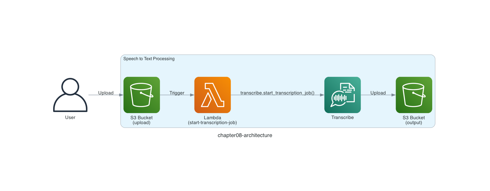

# Chapter 8: Transcribe Speech to Text

## Serverless Pattern

In Chapter 8, we return once more to the serverless pattern "**Image processing and simple data transformation**" that you experienced in Chapter 3. In Chapter 3 we used AWS Lambda for the image processing, but you do not necessarily have to use AWS Lambda — you can also combine other managed services.


*Image processing and simple data transformation*
*Quoted from [Serverless Patterns (AWS Japan, in Japanese)](https://aws.amazon.com/jp/serverless/patterns/serverless-pattern/)*

## Architecture

The architecture looks like the diagram below.

AWS has a service called [Amazon Transcribe](https://aws.amazon.com/transcribe/) that transcribes speech to text. And LocalStack supports Amazon Transcribe.

When you upload an audio file to Amazon S3, an AWS Lambda function calls Amazon Transcribe, and finally the transcription file is uploaded to a different Amazon S3 bucket.



## Vosk

You might wonder: the transcription logic of Amazon Transcribe is not public, so how does LocalStack support Amazon Transcribe?

LocalStack's Amazon Transcribe internally uses a library called **Vosk** to perform transcription. Vosk supports more than 20 languages, including English and Japanese. So when you use Amazon Transcribe with LocalStack, it is important to treat it as a way to test interface compatibility rather than to rely on transcription accuracy.

See the [Vosk website](https://alphacephei.com/vosk/) for details.

## Deploy the Serverless Application

Deploy the serverless application with the `samlocal` command.

```sh
$ cd ${CODESPACE_VSCODE_FOLDER}/chapter08
$ samlocal build
$ samlocal deploy

Successfully created/updated stack - chapter08-stack in us-east-1
```

If you see `Successfully created/updated stack - chapter08-stack`, it worked!

## Run the Serverless Application

This time we used [Amazon Polly](https://aws.amazon.com/polly/) — a service that generates speech from text, the opposite of Amazon Transcribe — to create an audio file for verification in advance. In the audio file, a voice says **Run Locally, Deploy Globally.**[^1]

Let's go ahead and upload the audio file `localstack.mp3` to the Amazon S3 bucket with the `awslocal` command.

```sh
$ awslocal s3api put-object \
  --bucket chapter08-inputs-bucket \
  --key localstack.mp3 \
  --body mp3/localstack.mp3
```

## Verify the Resources

Let's use the LocalStack AWS CLI (`awslocal`) to check the chapter08-outputs-bucket bucket!

> [!NOTE]
> On the first run, LocalStack downloads FFmpeg and the speech recognition model internally, so it can take 5 to 10 minutes for the transcription to complete and the JSON file to be saved. Wait until the `TranscriptionJobStatus` shown by `awslocal transcribe list-transcription-jobs` becomes `COMPLETED`.

```sh
$ awslocal s3 ls chapter08-outputs-bucket
2026-07-27 00:00:00        665 job-749d05be-cf64-4489-b34c-badd9b8c319e.json
```

> [!WARNING]
> If the JSON file does not exist in the Amazon S3 bucket, the Amazon Transcribe transcription job may have failed. If you look at the details of the transcription job with `awslocal transcribe list-transcription-jobs`, you might see `Installation of ffmpeg 7.0.1 failed.` in `FailureReason`. Depending on the IP address assigned to your GitHub Codespaces, LocalStack's Amazon Transcribe may fail to download the FFmpeg it depends on internally. I reproduced this myself once every few tries. The LocalStack container log showed the following error:
>
> > Failed to download archive from https://www.johnvansickle.com/ffmpeg/releases/ffmpeg-7.0.1-amd64-static.tar.xz
>
> There is currently no workaround, so if this happens to you, please skip the JSON file check.

The Amazon S3 bucket should contain an object named something like `job-749d05be-cf64-4489-b34c-badd9b8c319e.json`. When you look at its contents, you can see that it was transcribed as `run locally deploy globally`. Handy, isn't it?

```sh
$ awslocal s3 cp s3://chapter08-outputs-bucket/job-749d05be-cf64-4489-b34c-badd9b8c319e.json - | jq .
{
  "jobName": "job-749d05be-cf64-4489-b34c-badd9b8c319e",
  "status": "COMPLETED",
  "results": {
    "transcripts": [
      {
        "transcript": "run locally deploy globally"
      }
    ],
    "items": [
      {
        "start_time": 0.12,
        "end_time": 0.36,
        "type": "pronunciation",
        "alternatives": [
          {
            "confidence": 1,
            "content": "run"
          }
        ]
      },
      {
        "start_time": 0.36,
        "end_time": 0.9,
        "type": "pronunciation",
        "alternatives": [
          {
            "confidence": 1,
            "content": "locally"
          }
        ]
      },
      {
        "start_time": 0.96,
        "end_time": 1.38,
        "type": "pronunciation",
        "alternatives": [
          {
            "confidence": 1,
            "content": "deploy"
          }
        ]
      },
      {
        "start_time": 1.38,
        "end_time": 1.95,
        "type": "pronunciation",
        "alternatives": [
          {
            "confidence": 1,
            "content": "globally"
          }
        ]
      }
    ]
  }
}
```

That's it for Chapter 8! ✋

Congratulations on completing the workshop! 🎉

## Code Walkthrough

Here is a quick walkthrough of the key points in the code. Feel free to skip this section.

### `src/app.py`

The Amazon Transcribe [`transcribe.start_transcription_job()`](https://boto3.amazonaws.com/v1/documentation/api/latest/reference/services/transcribe/client/start_transcription_job.html) function runs an Amazon Transcribe transcription job. There are many options you can set, but here we keep it simple with just `Media` and `LanguageCode`.

`MediaFileUri` specifies the object to transcribe, and just like in Chapter 3, we take the uploaded object from the Amazon S3 event information.

```python
def lambda_handler(event, context):
    for record in event['Records']:
        transcribe.start_transcription_job(
            TranscriptionJobName=f'job-{str(uuid.uuid4())}',
            Media={
                'MediaFileUri': f's3://{record['s3']['bucket']['name']}/{record['s3']['object']['key']}',
            },
            LanguageCode='en-US',
            OutputBucketName=OUTPUT_BUCKET_NAME,
        )
```

That's it for the code walkthrough.

**Back to the [Table of Contents](../README.md)**

[^1]: Quoted from the catchphrase on the LocalStack website.
